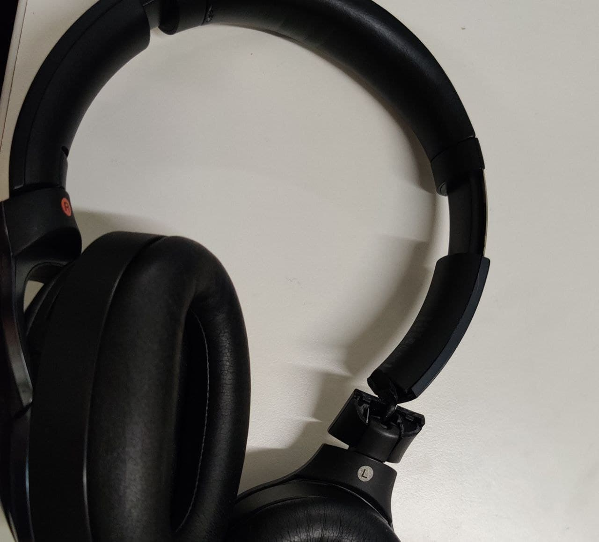
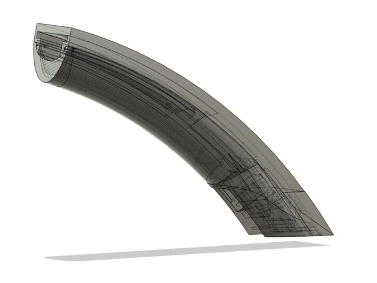
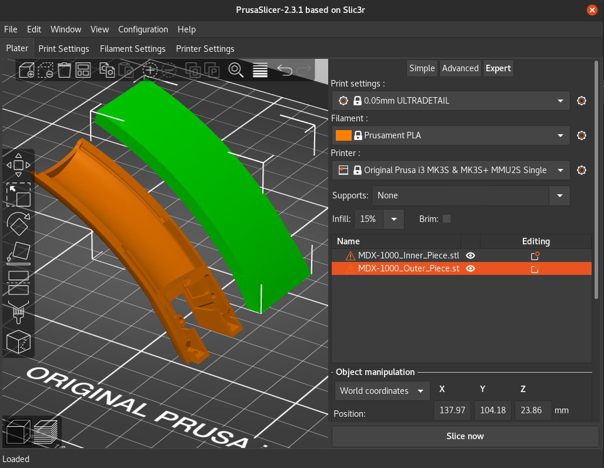
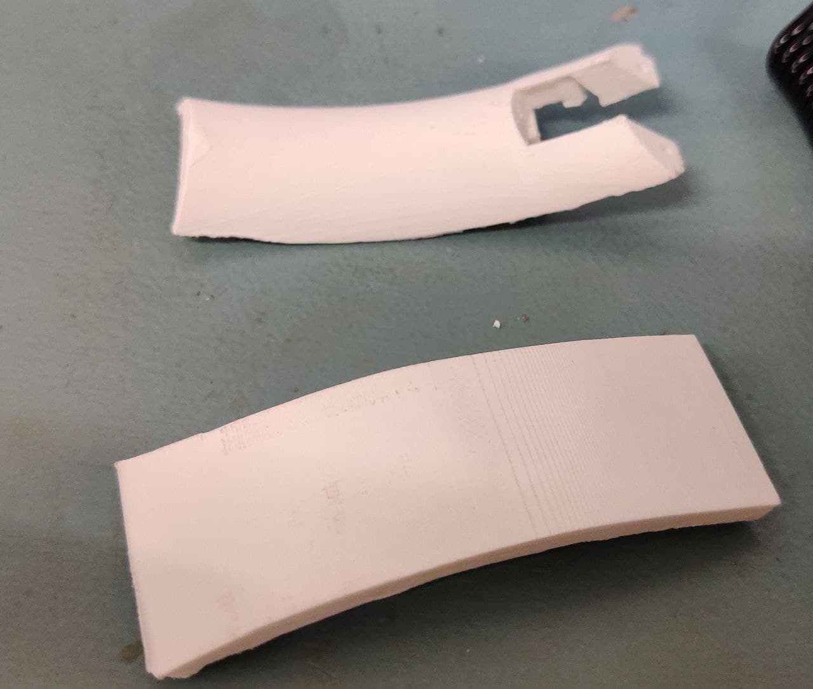
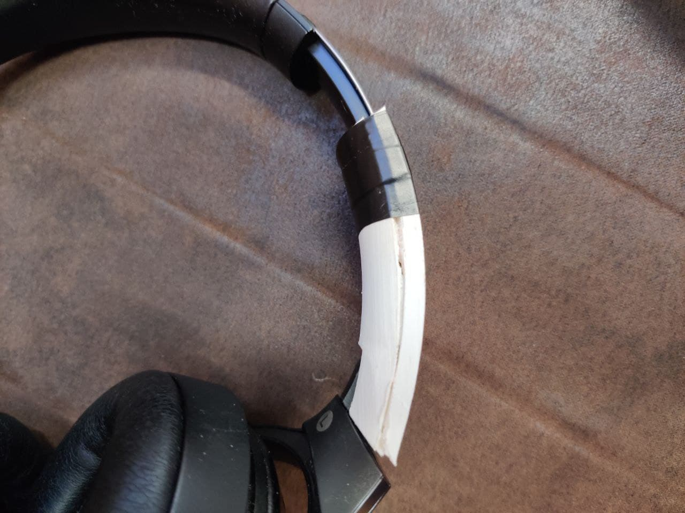

# Repairing my headphones with 3D Printing
My headphones broke because Sony is cheap and doesn't want to make lasting parts. Online, the replacement parts cost around 30 USD + 20 USD shipment. I decided to learn 3D printing instead. Got a new skill and spent only around ~1 CHF instead.

*Jump to the bottom for the final result*

## 1. Searching for a model

I scoured the internet and noticed most replacement parts were unofficial 3D printed versions. This means 3D designs of my broken piece existed! I thus found this design by DoughtCom on [Thingiverse](https://www.thingiverse.com/thing:4174399):

## 2. Transforming it into something Prusa 3D printer can understand

I then downloaded the Prusa slicer which, given a .stl model will transform it into .gcode, taking into account the printer specs.

## 3. Sending it to the machine

Robopoly, the place where I am printing has a useful site on which one can send files at distance and the machine starts printing, I thus added my job and watched from the webcam as it started printing

## 4. Failures and successes

The first print failed because it didn't have enough supports. After a few tweaks and a 7h print at 0.5mm of layer height, I was able to obtain this:

## 5. Final product

The two pieces were unable to clip together, probably beacause we heated them to mold them a little more with Teo. If I were to improve I would try a resin printer which would require less supports, is more precise. I used electrical tape to hold the top part together.

